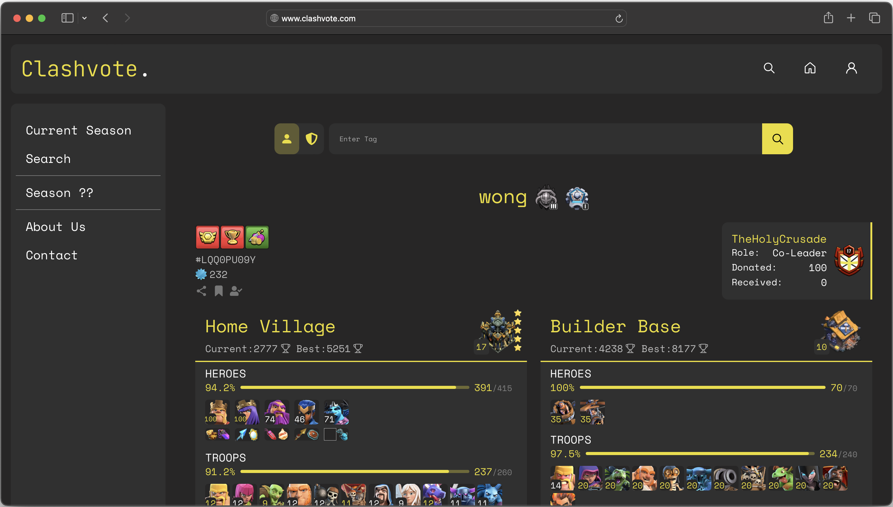

<h2 align="center">
  Clashvote.
</h2>
<div align="center">
    
</div>

## Overview
A website for Clash of Clans players to vote on various aspects on the game. This application also features player and clan searches, showing deep insight to what a player can do, not only for their own base but for their clan as well.

## Features
- Responsive design for all screen types and sizes
- Interactive and pleasing UI made with React.js and Sass
- Utilizes the official Clash of Clans API

## Installation
1. Clone the repository:
   ```sh
   git clone https://github.com/josedrios/clashvote.git
   ```
2. Navigate into the project folder:
   ```sh
   cd clashvote
   ```
3. Install dependencies:
   ```sh
   npm install
   ```
4. Run the development server:
   ```sh
   npm run sd
   ```
5. Open `http://localhost:5173` in your browser.

## Contact
Feel free to reach out via:
- Email: josederios@outlook.com
- GitHub: <a href="https://github.com/josedrios" target="_blank" rel="noopener noreferrer">josedrios</a>
- LinkedIn: <a href="https://www.linkedin.com/in/jose-rios-3b9505254/" target="_blank" rel="noopener noreferrer">Jose Rios</a>

## License
This project is licensed under the MIT License.